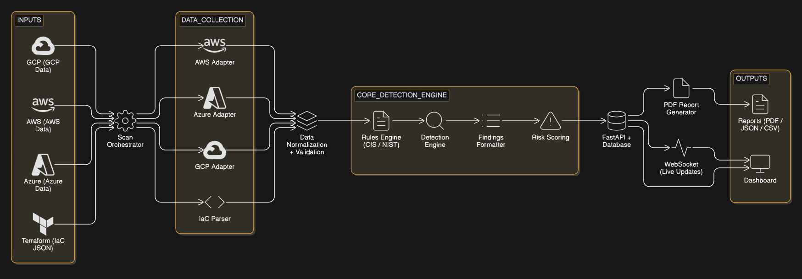

# Nirikshak - Cloud Misconfiguration Scanner

Nirikshak is a self-hosted, rule-driven cloud misconfiguration scanner for AWS, Azure, and GCP. It detects high-impact security issues using transparent rules mapped to CIS and NIST benchmarks, with no SaaS dependency.

---

## Overview

Nirikshak audits both live cloud environments and Infrastructure-as-Code plans. It detects misconfigurations such as:

* Public storage buckets
* Open SSH/RDP access
* Disabled logging
* Missing encryption
* Weak IAM policies

It normalizes provider-specific data into a unified schema and evaluates it using rule-driven logic mapped to CIS and NIST benchmarks. Output is structured, consistent, and audit-ready.

Unlike typical CSPM tools, Nirikshak exposes all rules, runs fully offline, and applies identical logic to both deployed infrastructure and IaC plans.

---

## Problem Statement

Cloud misconfigurations expose sensitive systems across government platforms, PSUs, BFSI, healthcare, and startups.

Common failures:

* Public data exposure via storage services
* Overly permissive network rules
* Logging disabled or misconfigured
* Missing encryption controls

Most CSPM tools fail here:

* SaaS-dependent, not deployable in restricted environments
* Detection logic hidden
* Not usable in academic or air-gapped setups

Nirikshak runs locally, exposes all detection logic, and produces consistent outputs.

---

## Features

* **Multi-Cloud Support:** AWS, Azure, GCP
* **IaC Scanning:** Terraform JSON plan evaluation before deployment
* **Rule Engine:** YAML/JSON rules mapped directly to CIS/NIST
* **Unified Execution:** Same rules applied to live cloud and IaC
* **Agentless:** Read-only scanning
* **Structured Findings:** Resource, severity, impact, fix, compliance
* **Risk Scoring:** Critical / High / Medium / Low with aggregate score
* **Reports:** JSON, CSV, PDF
* **Realtime Feedback:** WebSocket-based scan progress
* **Self-Hosted:** No telemetry, no external calls

---

## Architecture

Nirikshak uses a layered pipeline.



### Components

#### Input Layer

* Live cloud configurations (AWS, Azure, GCP)
* Terraform `plan -json` output

#### Collection Layer

* AWS: `boto3`
* Azure: `azure-mgmt`
* GCP: `google-cloud`
* Extracts configuration metadata using read-only access

#### Normalization Layer

* Converts provider-specific formats into a unified schema
* Ensures rule consistency across clouds

#### Rules Engine

* YAML/JSON rules mapped to CIS/NIST
* No abstraction layer; logic is explicit
* Same rules reused for IaC and live scans

#### Detection and Scoring Engine

* Evaluates normalized data
* Assigns severity based on exposure and impact

#### API and Storage Layer

* FastAPI backend
* SQLite (local) / PostgreSQL (single-node use)
* No external communication

#### Visualization and Reporting

* Real-time dashboard (WebSocket updates)
* Export: JSON, CSV, PDF
* Scan history tracking

---

## How It Works

1. User selects cloud provider or Terraform plan
2. Scan starts via CLI or API
3. Resources collected using adapters
4. Data normalized into internal schema
5. Rules executed against configurations
6. Misconfigurations detected and scored
7. Results stored locally
8. Reports generated and dashboard updated

---

## Dashboard UX Flow

1. **Before Scan:** Empty state, zero metrics
2. **Run Scan:** Select provider → trigger scan
3. **During Scan:** Live progress via WebSocket
4. **Processing:** Backend executes full scan pipeline
5. **After Scan:** Findings table populated automatically
6. **Download:** Export PDF/CSV report

---

## Sample Findings JSON

```json
{
  "scan_id": "f7c1a2b3-9d88-4aef-a6c1-1234567890ab",
  "provider": "aws",
  "status": "completed",
  "risk_score": 82,
  "summary": {"critical":2,"high":3,"medium":1,"low":0},
  "findings":[
    {
      "resource_id": "bucket123",
      "type": "s3_bucket",
      "severity": "CRITICAL",
      "description": "Public access enabled on S3 bucket.",
      "impact": "Sensitive data exposure.",
      "fix_suggestion": "Disable public access at bucket level.",
      "compliance": "CIS AWS 2.2"
    },
    {
      "resource_id": "vm456",
      "type": "vm_instance",
      "severity": "HIGH",
      "description": "RDP port 3389 open to all.",
      "impact": "Unauthorized remote access risk.",
      "fix_suggestion": "Restrict RDP access via security group.",
      "compliance": "CIS AWS 4.2"
    }
  ],
  "metrics": {"scan_time_sec":4.2,"resources_per_sec":11.3,"findings_density":0.33},
  "timestamp": "2026-03-28T12:00:00Z",
  "report_path": "/download/f7c1a2b3-9d88-4aef-a6c1-1234567890ab"
}
```

---

## Tech Stack

### Current Tech Stack

1. **Core Language:** Python 3.10+
2. **Backend API:** FastAPI
3. **Cloud SDKs:** AWS (`boto3`), Azure (`azure-mgmt`), GCP (`google-cloud`)
4. **IaC Scanning:** Terraform JSON plan parsing
5. **Rules Engine:** YAML/JSON rules, PyYAML
6. **CLI:** argparse, Typer
7. **Data Storage:** SQLite (default), PostgreSQL (single-node use)
8. **Frontend / Dashboard:** HTML, CSS, Vanilla JS
9. **Data Visualization:** Chart.js (limited use)
10. **Reporting:** PDF (ReportLab / WeasyPrint), CSV
11. **Realtime:** WebSockets
12. **Dev & Security Tools:** Poetry, Bandit, Black, Ruff

---

### Planned Tech Stack

1. **Core Platform Expansion:** Modular adapters for deeper cloud service coverage
2. **IaC Expansion:** CloudFormation and additional IaC tools
3. **CI/CD Integration:** Pipeline-based pre-deployment scanning
4. **Backend Evolution:** Persistent, multi-user PostgreSQL backend
5. **Drift Detection:** Lightweight monitoring agent
6. **Compliance Expansion:** Industry-specific standards beyond CIS/NIST
7. **Frontend Upgrade:** React with Tailwind / Chakra UI
8. **Advanced Visualization:** Recharts, D3.js
9. **Realtime Enhancements:** Alerts and live risk tracking
10. **Detection Enhancements:** Optional ML-based anomaly filtering

---

## Getting Started

```bash
git clone https://github.com/arasu/Nirikshak.git
cd Nirikshak
python -m venv .venv
source .venv/bin/activate  # Windows: .venv\Scripts\activate
pip install -r requirements.txt
uvicorn api.app:app --host 127.0.0.1 --port 8000
```

Open `dashboard/index.html`, select provider, run scan, download report.

---

## API Endpoints

* `POST /scan/{provider}` – trigger scan
* `GET /results` – latest findings
* `GET /history` – past scans
* `GET /download/{scan_id}` – PDF report
* `WS /ws/scan` – live progress

---

## Limitations

* Read-only; no auto-remediation
* Single-tenant design
* No drift tracking between scans
* No runtime behavior analysis
* Rule-based detection only

---

## Roadmap

### Phase 1: Core Engine

* Expand CIS/NIST coverage
* Improve scoring model
* Modular adapters

### Phase 2: IaC & Pipeline Integration

* Terraform + CloudFormation
* CI/CD integration

### Phase 3: Platform Layer

* Persistent backend
* Multi-user dashboard
* Scan history and filters

### Phase 4: Advanced Capabilities

* Drift detection
* Risk trend analysis
* Extended compliance mapping

### Phase 5: Scaling

* Alerting
* Lightweight monitoring agent

---

## Team

* **M Kishoreraj (Team Lead):** Architecture, engine, adapters, scoring
* **Viswanaathan Chidambaram:** CIS/NIST mapping, validation
* **Kodali Aniketh Kumar:** API, dashboard, reporting

---

## References

### Open-Source CSPM

* [https://github.com/prowler-cloud/prowler](https://github.com/prowler-cloud/prowler)
* [https://github.com/nccgroup/ScoutSuite](https://github.com/nccgroup/ScoutSuite)
* [https://github.com/bridgecrewio/checkov](https://github.com/bridgecrewio/checkov)

### Cloud & IaC

* [https://boto3.amazonaws.com/v1/documentation/api/latest/index.html](https://boto3.amazonaws.com/v1/documentation/api/latest/index.html)
* [https://developer.hashicorp.com/terraform/docs](https://developer.hashicorp.com/terraform/docs)
* [https://developer.hashicorp.com/terraform/internals/json-format](https://developer.hashicorp.com/terraform/internals/json-format)

### Compliance

* [https://www.cisecurity.org/benchmark/amazon_web_services](https://www.cisecurity.org/benchmark/amazon_web_services)
* [https://www.cisecurity.org/benchmark/azure](https://www.cisecurity.org/benchmark/azure)
* [https://www.cisecurity.org/benchmark/google_cloud_computing_platform](https://www.cisecurity.org/benchmark/google_cloud_computing_platform)
* [https://csrc.nist.gov/publications/detail/sp/800-53/rev-5/final](https://csrc.nist.gov/publications/detail/sp/800-53/rev-5/final)

---
## License

This project is released under the [MIT License](LICENSE)

---
