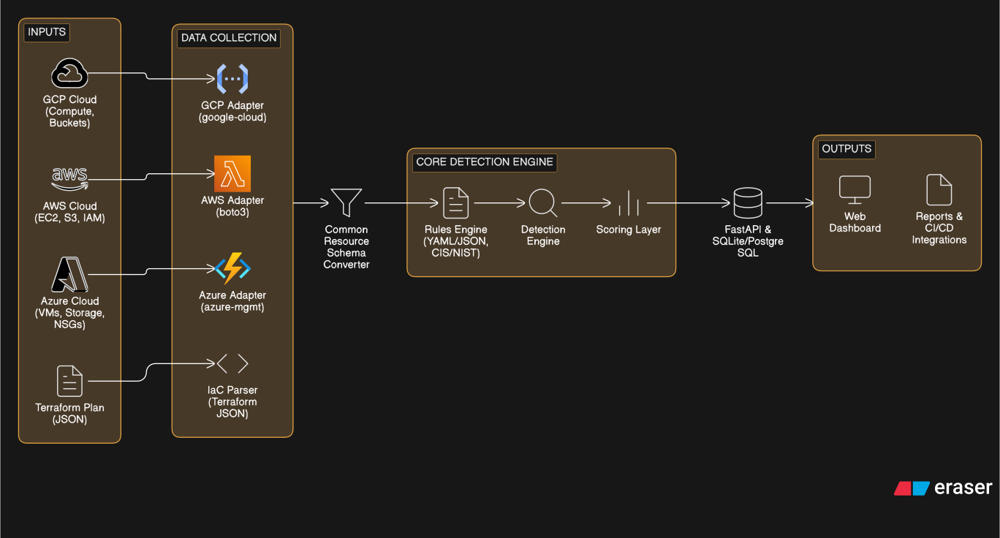

# Nirikshak
Nirikshak is an indigenous, self-hosted cloud misconfiguration auditing framework specifically designed for Education, Controlled Deployments, and early risk detection in India’s Critical Digital Infrastructure. It prioritizes transparency, standards alignment and also capability building over commercial scale

# Nirikshak Architecture

# Nirikshak Components

## Nirikshak Scanner
